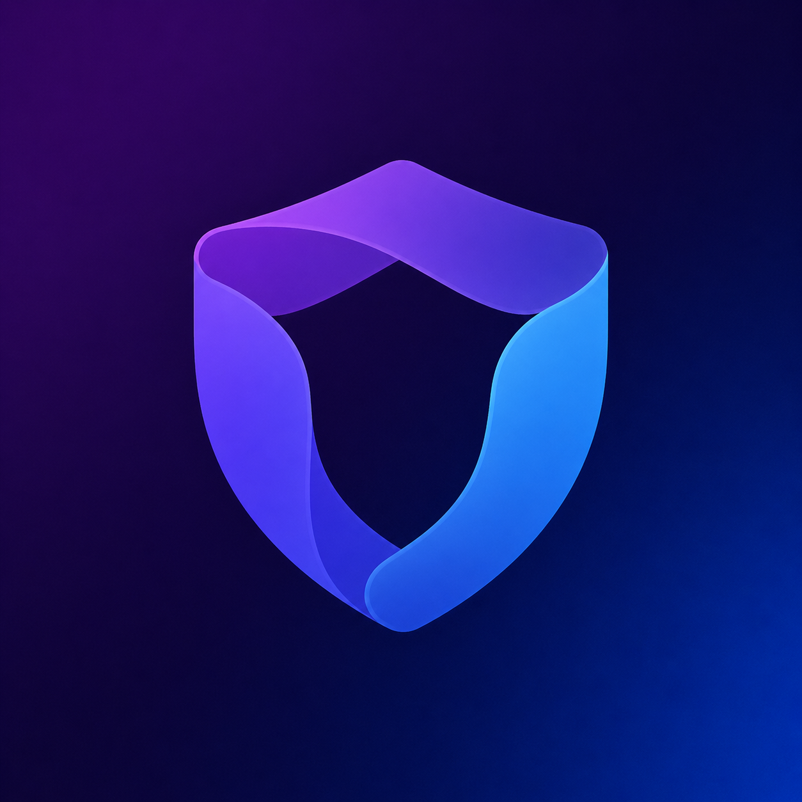
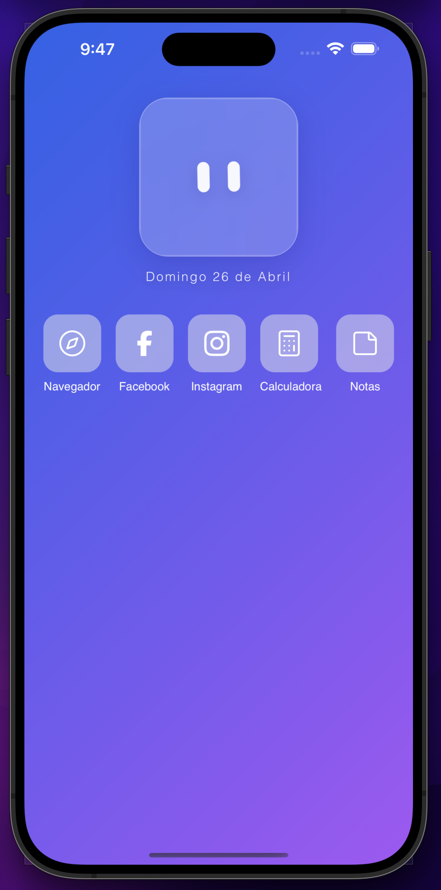
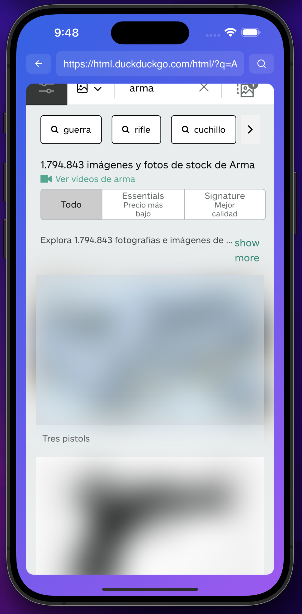
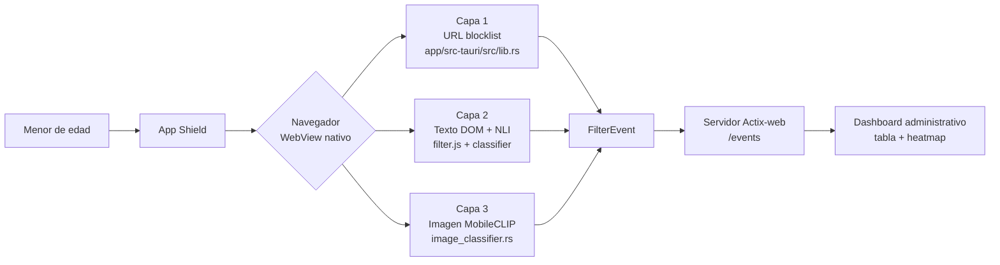
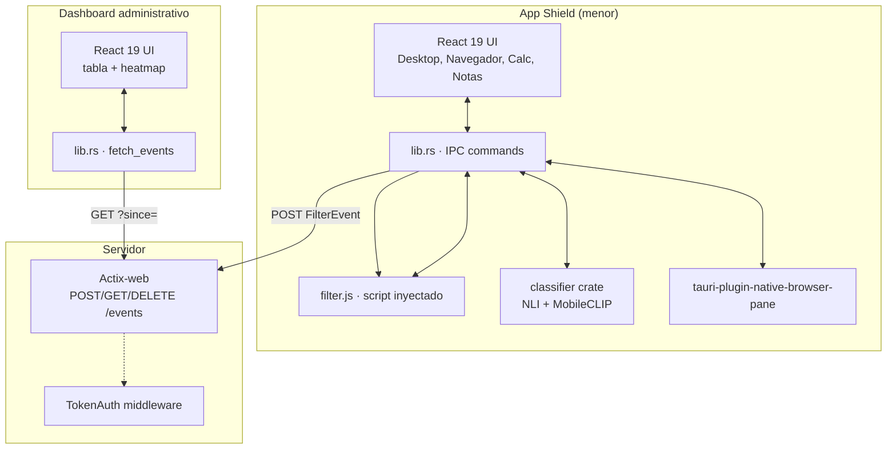

<div align="center">



# Shield

**Sandbox seguro para menores — IA en el dispositivo, filtrado en tres capas, multiplataforma.**

[](https://tauri.app/)
[](https://react.dev/)
[](https://www.typescriptlang.org/)
[](https://www.rust-lang.org/)
[](https://www.python.org/)
[](https://onnxruntime.ai/)
[](#convocatoria)

[Demo](#demo) · [Arquitectura](#arquitectura) · [Inteligencia Artificial](#inteligencia-artificial--documentación-explícita) · [Ejecución](#ejecución)

</div>

---

## Tabla de contenidos

- [Sobre el proyecto](#sobre-el-proyecto)
- [Capturas](#capturas)
- [El problema](#el-problema)
- [La solución: filtrado en tres capas](#la-solución-filtrado-en-tres-capas)
- [Características destacadas](#características-destacadas)
- [Stack tecnológico](#stack-tecnológico)
- [Arquitectura](#arquitectura)
- [Inteligencia Artificial — documentación explícita](#inteligencia-artificial--documentación-explícita)
- [Ejecución](#ejecución)
- [Demo](#demo)
- [Estructura del repositorio](#estructura-del-repositorio)
- [Equipo](#equipo)
- [Convocatoria](#convocatoria)

---

## Sobre el proyecto

**Shield** es una aplicación multiplataforma —desktop, iOS y Android— que funciona como un **entorno seguro** para menores de edad: un sandbox que reemplaza la experiencia abierta del dispositivo por un conjunto acotado de aplicaciones supervisadas. La selección actual incluye **Navegador**, **Facebook**, **Instagram**, **Calculadora** y **Notas**; el catálogo es deliberadamente extensible y la calculadora y las notas evidencian que Shield aspira a cubrir capacidades de un sistema operativo de uso diario, no únicamente la navegación.

La diferencia frente a controles parentales o filtros a nivel de red no está en el catálogo de apps, sino en lo que ocurre debajo: cada vez que el menor consume contenido, **tres capas independientes de filtrado** —URL, texto del DOM e imágenes— inspeccionan ese contenido **directamente en el dispositivo** usando ONNX Runtime nativo. Sin nube, sin latencia de red en la ruta crítica, sin que ningún texto o imagen del menor abandone el equipo.

En paralelo, Shield expone un **dashboard administrativo** independiente (también construido con Tauri + React) pensado para el equipo supervisor —no para el padre individual—. Recibe únicamente eventos anónimos de telemetría (tipo de filtrado, acción tomada, categoría detectada, URL) vía un servidor Actix-web, y los presenta como tabla ordenable y *heatmap espacial* en tiempo real, sin almacenar el contenido original.

La arquitectura prioriza tres principios: **privacidad por diseño** (cómputo local), **defensa en profundidad** (cada capa cubre los huecos de las otras) y **portabilidad real** (un único workspace de Cargo + Tauri compila para los cinco sistemas operativos objetivo).

---

## Capturas

<table>
  <tr>
    <td align="center" width="33%">
      <br/>
      <sub><b>Home</b> — sandbox con las apps disponibles</sub>
    </td>
    <td align="center" width="33%">
      <br/>
      <sub><b>Capa 2</b> — texto censurado en resultados de búsqueda</sub>
    </td>
    <td align="center" width="33%">
      <br/>
      <sub><b>Capa 3</b> — imágenes de una búsqueda censuradas</sub>
    </td>
  </tr>
</table>

<br/>

<div align="center">
  <br/>
  <sub><b>Dashboard administrativo</b> — KPIs en tiempo real, distribución por servicio, tendencias y feed de eventos en vivo</sub>
</div>

---

## El problema

Los menores que acceden a internet sin supervisión quedan expuestos a contenido para adultos, lenguaje violento, imágenes explícitas y dinámicas de grooming. Las soluciones existentes —controles parentales del sistema operativo, extensiones de navegador, *router-level filtering*— comparten tres limitaciones estructurales:

1. **Son fácilmente evadibles.** Un cambio de DNS, una sesión de incógnito o un perfil distinto basta para sortearlas.
2. **Requieren configuración técnica avanzada** del adulto a cargo, lo que crea una brecha real entre quien necesita la herramienta y quien sabe instalarla.
3. **No ofrecen visibilidad en tiempo real** del contenido que el menor está consultando, ni mucho menos correlación espacial con la página visitada.

Shield aborda los tres frentes: el menor opera dentro de un entorno acotado donde cada interacción —navegación, búsquedas, redes sociales, lectura de texto, visualización de imágenes— atraviesa los filtros antes de renderizarse; el equipo supervisor accede a un dashboard listo para usar sin tocar configuración del sistema; y cada decisión de filtrado se reporta como un evento anónimo, URL y categoría detectada.

---

## La solución: filtrado en tres capas



| Capa | Mecanismo | Dónde vive |
|------|-----------|------------|
| **1 · URL** | Antes de que el WebView cargue la página, el backend Rust valida el dominio contra una lista negra. Si hay coincidencia, la navegación se cancela y se emite un `FilterEvent` con acción `Block`. | `app/src-tauri/src/lib.rs` (líneas 177–188) |
| **2 · Texto** | Un script inyectado a `document-start` oculta todo `<p>`/`<h1>`–`<h6>` con CSS `color: transparent`, recorre el DOM con un `TreeWalker` y envía lotes de hasta 10 textos por IPC al pipeline NLI zero-shot. El texto marcado se reescribe reemplazando ~30 % de caracteres alfabéticos por `-`, preservando la estructura HTML. | `app/src-tauri/src/filter.js` + `classifier/src/nli.rs` |
| **3 · Imagen** | Las `` arrancan con `filter: blur(24px)` por CSS. Un `IntersectionObserver` las encola (máx. 2 fetches concurrentes), envía los bytes brutos al backend Rust por IPC binario, y MobileCLIP-S1 decide. Si Block: redimensión 128×128 + `fast_blur(σ=8.0)` + JPEG re-encodeado. Si Allow: bytes originales sin re-encode. | `app/src-tauri/src/lib.rs` (líneas 422–482) + `classifier/src/image_classifier.rs` |

El cierre del flujo es un `EventEmitter` que postea cada decisión `Block`/`Warn` (no `Allow`) al servidor con bearer token, en una `tokio::task` no bloqueante: si el servidor cae, la app no se ve afectada.

---

## Características destacadas

<table>
<tr>
<td valign="top" width="50%">

**Privacidad real**
- Toda la inferencia ocurre en el dispositivo (CPU / GPU / Apple Neural Engine vía CoreML EP).
- Solo eventos anónimos —sin contenido original— viajan al servidor administrativo.
- Telemetría minimalista: tipo, acción, categorías, coordenadas y URL. Nada del contenido del menor.

**Defensa en profundidad**
- Pre-hide CSS impide que cualquier texto/imagen sea visible *antes* de que la IA decida.
- *Fail-closed*: si el clasificador falla, la imagen se devuelve borrosa por defecto.
- `MutationObserver` re-clasifica nodos nuevos en SPAs (Instagram, Facebook).

</td>
<td valign="top" width="50%">

**Ingeniería para el throughput**
- Caché LRU de 4096 decisiones (`pipeline.rs`) por hash de `(texto, contexto)`.
- IPC binario nativo de Tauri para imágenes — sin base64, sin JSON.
- Dedup de textos repetidos antes de invocar el modelo (chunks de 12 en iOS).
- `tokio::task::spawn_blocking` para no congelar el thread de IPC.

**Multiplataforma sin compromisos**
- Plugin Tauri **propio** (`tauri-plugin-native-browser-pane`) que envuelve `WKWebView` (iOS) y `WebView` (Android).
- FFI Rust ↔ Swift con `catch_unwind` y `ManuallyDrop` para evitar UB.
- El mismo workspace compila para macOS, Windows, Linux, iOS y Android.

</td>
</tr>
</table>

---

## Stack tecnológico

### Frontend (app del menor + dashboard administrativo)

| Tecnología | Versión | Propósito |
|---|---|---|
| Tauri | 2.x | Framework desktop/móvil con WebView nativo |
| React | 19.x | UI del sandbox y del dashboard |
| TypeScript | ~5.8 | Tipado estático del cliente |
| Tailwind CSS | 4.x | Estilos del frontend |
| Vite | 7.x | Build y dev server |
| React Router DOM | 7.x | Navegación entre apps internas |
| Lucide React, React Icons | latest | Iconografía |
| Bun | latest | Gestor de paquetes y runtime |

### Backend nativo (Rust workspace)

| Crate | Propósito |
|---|---|
| `app/src-tauri` | App principal: comandos IPC, blocklist de URLs, blur de imágenes, emisor de eventos |
| `dashboard/src-tauri` | App administrativa: polling y normalización de eventos |
| `classifier` | Pipeline NLI + clasificador de imágenes vía ONNX Runtime |
| `tauri-plugin-native-browser-pane` | Plugin custom que expone WKWebView (iOS) y WebView (Android) a Tauri 2 |
| `server` | API Actix-web para ingesta y polling de `FilterEvent` |
| `common` | Tipos compartidos (`FilterEvent`, `FilterKind`, `FilterAction`, `Coords`) y helpers de auth |

### Inteligencia Artificial

| Componente | Tecnología |
|---|---|
| Clasificador de texto (zero-shot NLI multilingüe) | `MoritzLaurer/multilingual-MiniLMv2-L6-mnli-xnli` exportado a ONNX |
| Clasificador de imagen | `apple/MobileCLIP-S1` exportado a ONNX (encoder de imagen 256×256 → 512-d) |
| Runtime de inferencia | ONNX Runtime con execution providers nativos (CoreML en iOS, default en desktop, lib externa en Android) |
| Tokenización | `tokenizers` (HuggingFace) |
| Tooling de exportación | Python 3.11+ con `uv`, `transformers`, `torch`, `onnx` |

### Herramientas y misceláneos

`rustup`, `cargo`, `bun`, `vite`, `uv`, `Mermaid` (diagramas), `swift-rs` (FFI iOS), `tokio`, `actix-web`, `serde`, `image`, `ndarray`.

---

## Arquitectura



### Estructura del workspace

```
hackathon404/
├── app/                              # App principal (Tauri + React)
│   ├── src/                          # Frontend: Desktop, Navegador, Calc, Notas
│   └── src-tauri/                    # Backend Rust + filter.js inyectado
├── dashboard/                        # Panel administrativo (Tauri + React)
│   └── src/                          # Tabla, heatmap, polling
├── classifier/                       # Pipeline NLI + MobileCLIP en Rust
├── classifier-py/                    # Pipeline NLI en Python (dev/testing)
├── nsfw-py/                          # Exportador MobileCLIP-S1 → ONNX
├── server/                           # Servidor de telemetría (Actix-web)
├── common/                           # Tipos compartidos + auth
├── tauri-plugin-native-browser-pane/ # Plugin WKWebView/Android WebView
├── images/                           # Logo y capturas
└── Cargo.toml                        # Workspace de seis crates
```

---

## Inteligencia Artificial

Shield integra modelos de IA que corren **en el dispositivo del menor**. A continuación se documenta cada uno con el formato pedido por la convocatoria —**cuál**, **para qué** y **en qué medida**— y al cierre se listan las herramientas de apoyo que se emplearon durante el hackathon.

### 1 · Clasificador NLI zero-shot multilingüe (texto)

**Cuál.** `MoritzLaurer/multilingual-MiniLMv2-L6-mnli-xnli` (HuggingFace), un modelo de Natural Language Inference multilingüe. Se ejecuta en producción dentro del crate `classifier/` vía ONNX Runtime nativo en Rust (`classifier/src/nli.rs`). Existe también una réplica en Python (`classifier-py/src/main.py`) que se usa para prototipado, ajuste de hipótesis y testing rápido.

**Para qué.** Clasificar texto arbitrario —barras de búsqueda, bloques de contenido del DOM, descripciones, comentarios— contra un conjunto **configurable** de categorías de riesgo (violencia, contenido sexual, grooming, drogas, etc.) **sin necesidad de un dataset etiquetado**. Las categorías y sus hipótesis se definen en `runtime.json`.

**En qué medida.** El pipeline (`classifier/src/pipeline.rs` + `decide.rs` + `lexical.rs`) opera en tres pasos:

1. **Atajo léxico (`lexical.rs`).** Si el texto contiene 2+ coincidencias contra listas configuradas (frases, emojis, hashtags, regex), se asigna directamente score `0.95` a esa categoría y se omite el modelo. Reduce latencia en los casos obvios.
2. **Inferencia NLI multi-label.** Si el atajo no se dispara, todas las hipótesis de todas las categorías se evalúan en una pasada con `multi_label=True`. El score por categoría es el máximo entre sus hipótesis.
3. **Boost léxico parcial.** Si hubo exactamente 1 coincidencia léxica, el score se eleva al mínimo `0.70` aunque el modelo haya devuelto menos.

La decisión final (`decide.rs`) usa umbrales por categoría:

| Score vs. umbral | Acción |
|---|---|
| Score < umbral | `Allow` (sin evento) |
| Score ≥ umbral | `Warn` (notifica al administrador) |
| Score ≥ umbral + 0.15 | `Block` (texto censurado) |

Optimizaciones notables: caché LRU de 4096 entradas keyed por `hash(texto, contexto)` (`pipeline.rs` líneas 37–50), margen neutral de 0.10 contra anchors *safe* para evitar falsos positivos, y procesamiento por chunks streaming para no bloquear la UI.

---

### 2 · Clasificador de imágenes MobileCLIP-S1

**Cuál.** `apple/MobileCLIP-S1`, un modelo de visión-lenguaje compacto entrenado por Apple. El encoder de imagen se exporta a ONNX con `nsfw-py/src/export.py` y se compara contra un set precomputado de **13 anchors de texto** (7 categorías de riesgo + 6 categorías seguras), almacenado como `.npy` (`text_features_anchors.npy`).

**Para qué.** Decidir si una imagen renderizable en el WebView pertenece a alguna de las siete categorías de riesgo definidas en `nsfw-py/src/export.py`: drogas, desnudez/contenido sexual, armas, narcotráfico, violencia, muerte, gore. El modelo es zero-shot — no se reentrena con datos de Shield.

**En qué medida.** `classifier/src/image_classifier.rs` aplica una regla de decisión binaria sobre los logits escalados:

```
ImageDecision::Block  ⇔  best_risk > best_safe + SAFETY_MARGIN  ∧  best_risk > RISK_THRESHOLD
```

con constantes `RISK_THRESHOLD = 0.55`, `SAFETY_MARGIN = 0.10`, `LOGIT_SCALE = 100.0`. El input se redimensiona a **256×256** (no 224 — MobileCLIP-S1 fue entrenado a 256, alinear esto es crítico).

Cuando la decisión es `Block`, el backend (`app/src-tauri/src/lib.rs` líneas 422–482):

1. Redimensiona la imagen a **128×128 px** con `FilterType::Triangle` (5× más rápido que Lanczos sin diferencia visible al estar destinada a ser borrosa).
2. Aplica `fast_blur` con σ=8.0 (blur separable gaussiano, ~5× más rápido que blur 2D completo).
3. Re-encoda como **JPEG**.
4. Devuelve los bytes por `tauri::ipc::Response` **binaria** — sin serialización JSON ni base64, evitando el overhead de ~33 % del encoding texto.

Si la decisión es `Allow`, los bytes originales pasan tal cual sin re-encode. Si la clasificación falla por cualquier razón, se aplica blur de todos modos (*fail-closed*).

---

### 3 · Filtrado de texto en DOM

**Cuál.** El script `app/src-tauri/src/filter.js` (765 líneas) inyectado por Tauri vía `initialization_script` a **`document-start`** en cada WebView, combinado con el comando IPC `filter_texts` que enruta al pipeline NLI descrito en §1.

**Para qué.** Censurar el contenido textual de cualquier página web sin bloquear la página completa. La filosofía es: *el menor debe percibir que existe contenido, pero no poder leerlo*. Por eso el texto censurado conserva longitud y estructura HTML, pero los caracteres alfabéticos se sustituyen por `-`.

**En qué medida.** El script implementa varios mecanismos coordinados:

- **Pre-hide CSS** (líneas 30–57): inyecta una hoja de estilo que oculta todo `<p>`/`<h1>`–`<h6>` con `color: transparent` y aplica `filter: blur(24px)` a todas las `` *antes* de que el clasificador haya decidido nada. Si la IA tarda o falla, el contenido nunca se vuelve visible.
- **TreeWalker batched** (líneas 461–665): recorre el DOM, filtra nodos triviales (UI buttons, scripts, `aria-hidden`, textos < 8 caracteres), agrupa los textos restantes en chunks de 10 y los envía al pipeline en una sola llamada IPC.
- **Reemplazo preservando HTML** (líneas 637–644): el resultado se asigna a `nodeValue` (no `textContent`), respetando elementos hijos como `<em>`, `<strong>`, `<a>` dentro del párrafo.
- **MutationObserver** (líneas 722–756): re-clasifica nodos añadidos dinámicamente — esencial para SPAs como Instagram o Facebook que cargan contenido sin recargar la página.
- **Loader overlay** (líneas 61–178): un `<dialog>` en *top-layer* CSS muestra "Filtrando contenido…" hasta que el primer batch responde.

---

> **Nota sobre privacidad.** Los tres clasificadores corren **en el dispositivo del menor** vía ONNX Runtime con execution providers nativos (CoreML en iOS, CPU/GPU en desktop). Ningún texto ni imagen del menor sale del equipo. Lo único que viaja al servidor administrativo es el `FilterEvent`: tipo (`text`/`image`), acción (`block`/`warn`), categorías detectadas, URL y timestamp. Esto es verificable inspeccionando `common/src/lib.rs` y `app/src-tauri/src/lib.rs` (`EventEmitter`, líneas 31–59).

### Herramientas de apoyo durante el desarrollo

Para acelerar el trabajo durante el hackathon se emplearon, además del flujo habitual del equipo:

- **Perplexity** — búsqueda profunda para validar decisiones técnicas (modelos de visión-lenguaje aptos para móvil, execution providers de ONNX Runtime, opciones de WebView nativo en Tauri 2).
- **Claude Code** — generación y refactor de código en Rust, TypeScript y Python, con revisión humana en cada cambio.
- **Gemini** — investigación complementaria y diagnóstico puntual de errores de integración.

---

## Ejecución

### Prerrequisitos

- [Rust](https://rustup.rs/) toolchain stable
- [Bun](https://bun.sh/) (gestor de paquetes JS)
- [Tauri CLI v2](https://tauri.app/start/prerequisites/): `cargo install tauri-cli --version "^2"`
- Python 3.11+ con [`uv`](https://github.com/astral-sh/uv): `pip install uv`
- Para Android: Android SDK + NDK configurados
- Para iOS: macOS + Xcode

### Quickstart

```bash
git clone https://github.com/zam-cv/hackathon404
cd hackathon404/app
bun install && bun run tauri dev
```

Eso levanta la app en desktop con toda la UI funcional. **Para ver el filtrado de IA en acción hay que ejecutar antes los dos exports de modelos** (NLI para texto y MobileCLIP para imágenes): los pesos no se incluyen en el repositorio (`*.onnx`, `*.npy` están gitignored) y deben generarse localmente. Ambos exports se documentan abajo.

### Por componente

<details>
<summary><b>App principal — desktop, Android, iOS</b></summary>

```bash
cd app

# Desktop (macOS / Windows / Linux)
bun run tauri dev

# Android
bun run tauri android dev

# iOS (requiere macOS + Xcode)
bun run tauri ios dev

# Build de producción
bun run tauri build
```

</details>

<details>
<summary><b>Exportar modelos de IA (requerido para activar el filtrado)</b></summary>

Los pesos de los modelos están gitignored (`*.onnx`, `*.npy`, `onnx_model/`). Para que el clasificador funcione hay que generar **dos** paquetes localmente:

**1) NLI multilingüe (texto)** — exporta y cuantiza `MoritzLaurer/multilingual-MiniLMv2-L6-mnli-xnli` a ONNX int8 dentro de `classifier-py/onnx_model/`:

```bash
cd classifier-py
cp .env.example .env             # define NLI_MODEL, categorías, hipótesis, umbrales
uv sync --extra export
uv run python src/export.py
```

Salida en `classifier-py/onnx_model/`: `model.onnx`, `tokenizer.json`, `config.json`, `meta.json`, etc.

**2) MobileCLIP-S1 (imagen)** — exporta el encoder de imagen y los 13 anchors de texto precomputados:

```bash
cd ../nsfw-py
uv sync
uv run python src/export.py
```

Salida en `nsfw-py/mobileclip/`: `mobileclip_image.onnx`, `text_features_anchors.npy` (y opcionalmente `mobileclip_text.onnx` con `--with-text`). La primera corrida descarga `apple/MobileCLIP-S1` (~140 MB) al cache de HuggingFace (`~/.cache/huggingface/`).

`app/src-tauri/build.rs` toma ambos paquetes y los enlaza/copia a `app/src-tauri/resources/{onnx_model,mobileclip}/` para que Tauri los empaquete en el bundle final.

</details>

<details>
<summary><b>Clasificador Python (banco de pruebas y ajuste de hipótesis)</b></summary>

`classifier-py/src/main.py` corre el pipeline NLI completo en Python (HuggingFace `transformers`) sobre los `TEST_CASES` definidos en `.env`. Es la forma rápida de iterar sobre categorías y umbrales antes de re-exportar y desplegar al runtime Rust.

```bash
cd classifier-py
cp .env.example .env
uv sync
uv run python src/main.py
```

Usa GPU automáticamente si CUDA está disponible; CPU en su defecto.

</details>

<details>
<summary><b>Servidor de telemetría</b></summary>

```bash
# Desde la raíz del workspace
SHIELD_AUTH_TOKEN=mi-token-secreto cargo run -p server
```

Levanta Actix-web en `http://127.0.0.1:7878` con tres endpoints:

| Método | Ruta | Descripción |
|---|---|---|
| `GET` | `/health` | Healthcheck sin auth |
| `POST` | `/events` | Ingesta de un `FilterEvent` (bearer token) |
| `GET` | `/events?since=<ms>` | Polling incremental para el dashboard |
| `DELETE` | `/events` | Limpia el buffer (auth) |

Diseñado como capa de ingesta ligera para el alcance del hackathon: el buffer vive en memoria (`VecDeque` con tope configurable) y la interfaz HTTP está desacoplada del almacenamiento, lo que permite intercambiarlo por Postgres, Kafka u otro backend persistente sin cambios en cliente ni dashboard.

</details>

<details>
<summary><b>Dashboard administrativo</b></summary>

```bash
cd dashboard
bun install
SHIELD_AUTH_TOKEN=mi-token-secreto bun run tauri dev
```

Polling cada 2 segundos contra el servidor; tabla ordenable de eventos y heatmap espacial sobre un viewport de referencia 1280×800.

</details>

### Variables de entorno

| Variable | Default | Usada por |
|---|---|---|
| `SHIELD_AUTH_TOKEN` | (requerida) | `server`, `app/src-tauri`, `dashboard/src-tauri` |
| `SHIELD_SERVER_URL` | `http://127.0.0.1:7878` | `app/src-tauri` (envío de eventos), `dashboard/src-tauri` (polling) |

Ambas se leen y cachean en `common/src/lib.rs`.

---

## Demo

<table>
  <tr>
    <td align="center" width="33%">
      <br/>
      <sub><b>Home en iOS</b> — sandbox con las apps disponibles y widget de fecha en español</sub>
    </td>
    <td align="center" width="33%">
      <br/>
      <sub><b>Capa 2 funcionando</b> — búsqueda en DuckDuckGo con párrafos censurados manteniendo la estructura del DOM</sub>
    </td>
    <td align="center" width="33%">
      <br/>
      <sub><b>Capa 3 funcionando</b> — búsqueda de "arma" con todas las imágenes censuradas</sub>
    </td>
  </tr>
</table>

<br/>

<div align="center">
  <br/>
  <sub><b>Dashboard administrativo (Sentinel)</b> — vista del equipo supervisor: endpoints activos, requests bloqueadas, alertas, picos de latencia 24 h, distribución por servicio y feed de eventos en vivo</sub>
</div>

> **Cómo verlo en vivo.** Por la naturaleza nativa del proyecto (Tauri + ONNX Runtime + WKWebView/Android WebView) Shield se experimenta corriéndolo localmente. Sigue la sección de [Ejecución](#ejecución) y la guía de exports de modelos para tenerlo funcionando en tu máquina.

---

## Estructura del repositorio

```
hackathon404/
├── app/                              # App principal (Tauri + React) — el "OS" del menor
├── classifier/                       # Pipeline NLI + MobileCLIP en Rust con ONNX Runtime
├── classifier-py/                    # Réplica del pipeline NLI en Python (dev/testing)
├── common/                           # Tipos compartidos: FilterEvent, FilterKind, FilterAction
├── dashboard/                        # Panel administrativo (Tauri + React) — tabla + heatmap
├── images/                           # Logo y capturas usadas en este README
├── nsfw-py/                          # Exportador MobileCLIP-S1 → ONNX
├── server/                           # Servidor Actix-web de telemetría
├── tauri-plugin-native-browser-pane/ # Plugin custom: WKWebView (iOS) + WebView (Android)
├── Cargo.toml                        # Workspace de 6 crates
└── README.md
```

---

## Equipo

**Equipo: Blackjack**

| Nombre |
|---|
| Carlos Alberto Zamudio Velázquez |
| Ivan Alexander Ramos Ramirez |
| Yael Octavio Perez Mendez |
| Sarai Campillo Galicia |

---

## Convocatoria

**Hackathon404 — Seguridad Digital Infantil.**

El proyecto fue desarrollado íntegramente durante el hackathon, con el primer commit el **24 de abril de 2026** y el último el **25 de abril de 2026**.

---

<div align="center">


<sub>Hecho en el <b>Hackathon404</b> por <b>Blackjack</b>.</sub>

</div>
